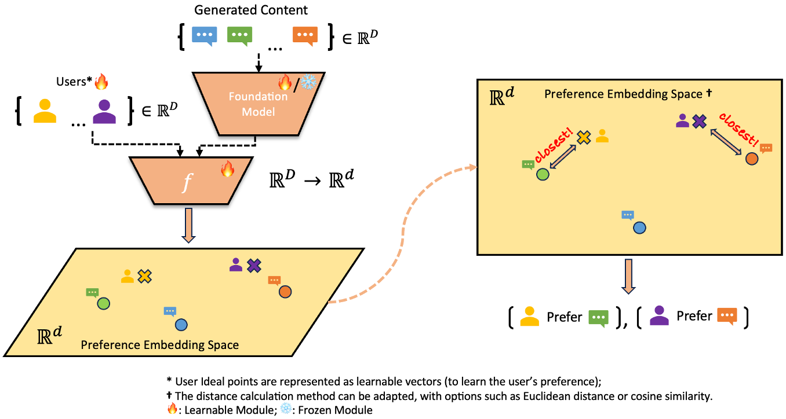

# PAL: <span style="font-size: 1.5em; color: #1E90FF;">P</span>luralistic <span style="font-size: 1.5em; color: #1E90FF;">AL</span>ignment Framework

[](https://github.com/tatsu-lab/stanford_alpaca/blob/main/LICENSE)

## [ 📝 [PAL: Sample-Efficient Personalized Reward Modeling for Pluralistic Alignment](https://openreview.net/pdf?id=1kFDrYCuSu)]

[Daiwei Chen](https://chendaiwei-99.github.io), [Yi Chen](https://www.deepneural.network/), [Aniket Rege](https://aniketrege.github.io/), [Zhi Wang](https://zwang.org/), [Ramya Korlakai Vinayak](https://ramyakv.github.io/)

[ 🌐 [PAL Project Page](https://pal-alignment.github.io/) ] [ 📜 [arXiv](https://arxiv.org/abs/2406.08469) ]

[ 📊 [Persona Dataset](https://huggingface.co/datasets/kitkatdafu/persona_in_pal); [Pick-a-Pic Dataset (embeddings)](https://huggingface.co/datasets/ramya-ml/pickapic-embeds);  [Pick-a-Filter Dataset (embeddings)](https://huggingface.co/datasets/ramya-ml/pick-a-filter-embeds/tree/main) ] 

# 📑 Citations

If you find **<u>*PAL*</u>** useful for your research and applications, please cite using these BibTeX:

```
@inproceedings{
      chen2025pal,
      title={{PAL}: Sample-Efficient Personalized Reward Modeling for Pluralistic Alignment},
      author={Daiwei Chen and Yi Chen and Aniket Rege and Zhi Wang and Ramya Korlakai Vinayak},
      booktitle={The Thirteenth International Conference on Learning Representations},
      year={2025},
      url={https://openreview.net/forum?id=1kFDrYCuSu}
}

@misc{
      chen2024palpluralisticalignmentframework,
      title={PAL: Pluralistic Alignment Framework for Learning from Heterogeneous Preferences}, 
      author={Daiwei Chen and Yi Chen and Aniket Rege and Ramya Korlakai Vinayak},
      year={2024},
      eprint={2406.08469},
      archivePrefix={arXiv},
      primaryClass={cs.LG},
      url={https://arxiv.org/abs/2406.08469}, 
}
```

# 📰 News

- 🔥 [NEW!] **PAL** has been accepted by **2025 ICLR** conference.
- **PAL** has been accepted at **2024 NeurIPS** workshops: [AFM](https://adaptive-foundation-models.org/), [Behavioral ML](https://sites.google.com/view/behavioralml/), [FITML](https://sites.google.com/view/neurips2024-ftw/home), [Pluralistic-Alignment](https://pluralistic-alignment.github.io/), [SoLaR](https://solar-neurips.github.io/).
- **PAL** has been accepted at **2024 ICML** workshops: [TF2M](https://sites.google.com/view/tf2m) and [MFHAIA](https://sites.google.com/view/mhf-icml2024).

# 📍 Overview

This repository contains the code for ***<u>PAL</u>*** (Personalized Alignment Learning), a novel framework for **pluralistic alignment** in foundation models. PAL enables efficient reward modeling that caters to <u>***diverse human preferences***</u>, allowing for **personalized adaptation** in both text and image generation tasks. The model balances *<u>**commonalities across users**</u>* with individual-specific customizations, achieving *<u>**few-shot localization**</u>* for new users and reducing the *<u>**sample requirements per user**</u>*.



# 💬 Contents

- [Overview](#overview📍)
- [Key Features](#🎯-Key-Features)
- [Installation](#💻-installation)
- [Usage](#🧰-usage)
  - [Data Preparation](##data-preparation)
  - [Configurations](##configurations)
  - [Training](##training)
  - [Integration](##integration)
- [Citation](#📑-citation)

# 🎯 Key Features

💠 <span style="color:lightblue; font-weight:bold;">Diverse Preference Alignment</span>: PAL can handle diverse human preferences rather than assuming a single, universal preference, addressing the variability in individual values.

💠 <span style="color:lightblue; font-weight:bold;">Accuracy-Compute Optimality</span>: e.g. For a T2T task, PAL is 1.7% more accurate for seen users and 36% more accurate for unseen users, with 20× fewer parameters.

💠  <span style="color:lightblue; font-weight:bold;">Modular Design</span>: PAL's architecture is modular, allowing it to leverage shared common preferences while adapting to specific individual preferences.

💠 <span style="color:lightblue; font-weight:bold;">Few-shot Generalization</span>: PAL enables quick adaptation to new users' preferences with few examples, making it more efficient for personalized alignment.

# 💻 Installation

> All code has been tested on Linux with `CUDA=12.4`; functionality on other systems  is not guaranteed.

1. Clone this repository and navigate into the PAL

   ```shell
   git clone https://github.com/RamyaLab/pluralistic-alignment.git
   cd pluralistic-alignment
   ```

2. Install Packages

   ``` sh
   conda env create --file environment.yml
   ```

> Notice: Ensure your environment supports **PyTorch** and **CUDA** (if you are using GPU acceleration). The `environment.yml` contains detailed package versions and setup instructions.

 # 🧰 Usage


 ```mermaid
graph LR
    A[Prepare the Preference Dataset with user IDs] --> B[Design Configurations]
    B --> C[Train the PAL Model]
    C --> D[Convert PAL Model into Standard Reward Model]
    D --> E[Ready for Further Applications]
 ```

## Data Preparation

Compared with typical preference datasets, each sample should also contain the `user_id` to learn each user's preference. The format of each sample should be `(user_id, prompt, (response_1), (response_2)),y`, where `user_id` is a unique identifier (string) for a specific user,  `prompt`, `response_1`, `response_2` are texts or other modalities,  $y\in \{-1, 1\}$ represents the user's preference. **<u>*(Notice:  modify `dataset_factory.py` is required for your customized datasets)*</u>**.

🎯 *<u>For detailed implementation, please refer to `dataset_factory.py`.</u>*

> We only include <u>*a variant of Reddit TL;DR Summary Dataset*</u> in this repository for demonstration purposes.

## Configurations

The `config` folder in this repository contains various configuration subfolders that allow for easy customization. These configuration subfolders are  `ds_config`, `loss_config`, `optim_config`, and `prefLearner_config`.

🎯 <u>*For more details, please review each file individually.*</u>

```
config
├── ds_config
│   ├── summary.yaml
│   └── ...
├── loss_config
│   ├── b-cumulative.yaml
│   └── ...
├── optim_config
│   ├── vanilla-e20.yaml
│   └── ...
└── prefLearner_config
    ├── b-dim512-k2-opt350m-mlp2.yaml
    ├── b-dim768-k2-distillbert65m-mlp2.yaml
    ├── b-dim1024-k2-bgem3-mlp2.yaml
    ├── b-dim1536-k2-qwen1-5b-mlp2.yaml
    ├── b-dim1536-k2-stella1-5b-mlp2.yaml
    └── ...
```

## Training Demos

The following scripts outline different training demos for PAL-B models, targeting various levels of model adaptation and user generalization.

### 1. PAL-B-Large (Large Setup)

This script trains the PAL-B-Large model by finetuning the foundation model, projector, and user weights.

```sh
# Train PAL-B-Large (Large: finetune the foundation + projectors + user weights)
CUDA_VISIBLE_DEVICES=0 python -u main_pal_b.py \
  --prefLearner_config ./config/prefLearner_config/b-dim512-k2-opt350m-mlp2.yaml \
  --run_name summary-pal-b-large-k2-mlp2 \
  2>&1 >| ./logs/summary-pal-b-large-k2-mlp.log 
```

### 2. PAL-B-Tiny (Tiny Setup)

This script trains the PAL-B-Tiny model by fixing the foundation model and only learning the projector and user weights.

```sh
# Train PAL-B-Tiny (Tiny: fix the foundation model and only learn the projectors + user weights)
CUDA_VISIBLE_DEVICES=1 python -u main_pal_b_fix_llm.py \
  --prefLearner_config ./config/prefLearner_config/b-dim512-k2-opt350m-mlp2.yaml \
  --run_name summary-pal-b-tiny-k2-mlp2 \
  2>&1 >| ./logs/summary-pal-b-tiny-k2-mlp2.log 
```

### 3. PAL-B New User Generalization

This script performs new user generalization by adapting the model to unseen users. It only learns the weights of new users based on a few samples per user.

```sh
# New User Generalization with n samples per unseen user (Only learn the weights of new users)
CUDA_VISIBLE_DEVICES=2 python -u main_pal_b_unseen.py \
  --ds_config ./config/ds_config/summary_unseen_{num_of_samples_per_unseen_user}samples.yaml \
  --prefLearner_config ./config/prefLearner_config/b-dim512-k2-opt350m-mlp2.yaml \
  --optim_config ./config/optim_config/vanilla-e20.yaml \
  --loss_config ./config/loss_config/b-cumulative.yaml \
  --state_dict_path /path/to/the/well-trained/pal/model.ckpt \
  --run_name summary-unseen-pal-b-cumulative-k2-mlp2-e20-{num_of_samples_per_unseen_user}sample \
  2>&1 >| ./logs/summary-unseen-pal-b-k2-mlp2-{num_of_samples_per_unseen_user}sample.log
```


## Experiment Reproduction

### 1: On the Reddit TL;DR Summary dataset, increasing # groups in our PAL model leads to a significant boost in preference prediction performance.
```sh
  # set # user preference groups to 1
  for i in {1..5}; do
      CUDA_VISIBLE_DEVICES=0 python -u main_pal_b.py \
          --prefLearner_config ./config/prefLearner_config/b-dim512-k1-opt350m-mlp2.yaml \
          --run_name summary-b-cumulative-k1-mlp2-run${i} \
          --device 0 \
          2>&1 >| ./logs/summary-b-cumulative-k1-mlp2-${i}.log
  done

  # set # user preference groups to 2
  for i in {1..5}; do
      CUDA_VISIBLE_DEVICES=1 python -u main_pal_b.py \
          --prefLearner_config ./config/prefLearner_config/b-dim512-k2-opt350m-mlp2.yaml \
          --run_name summary-b-cumulative-k2-mlp2-run${i} \
          --device 0 \
          2>&1 >| ./logs/summary-b-cumulative-k2-mlp2-${i}.log
  done
```
### 2. Given the well-trained PAL model above, PAL can generalize to new, unseen users with very few # preference pairs.
```sh
for j in 2 5 10 20 50 100; do
  for i in {1..5}; do
      CUDA_VISIBLE_DEVICES=1 python -u main_pal_b_unseen.py \
          --ds_config ./config/ds_config/summary_unseen_${j}samples.yaml \
          --prefLearner_config ./config/prefLearner_config/b-dim512-k2-opt350m-mlp2.yaml \
          --optim_config ./config/optim_config/vanilla-e20.yaml \
          --loss_config ./config/loss_config/b-cumulative.yaml \
          --state_dict_path /path/to/the/model(k=2)/trained/in/stage/1.ckpt \
          --run_name summary-unseen-b-cumulative-k2-mlp2-e20-sample${j}-run${i}
  done
done
```


## Integration

The `integration` subfolder provides code for **converting the PAL model into a standard reward model** (for further usage on RLHF).

> In the standard reward model format, the model takes a prompt and response as input and generates a reward value. 
> In contrast, our PAL model takes a prompt, two responses, and a user ID as input to predict the user’s choice.

To load the standard reward model version of the PAL model, use the following functions:

- `load_pal_rm_a()`
- `load_pal_rm_b()`


